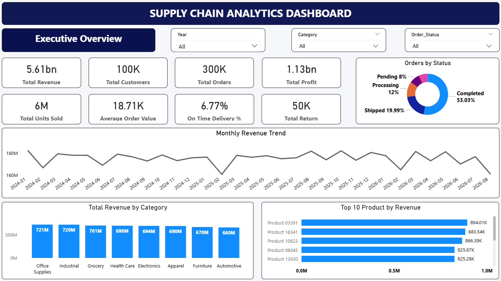
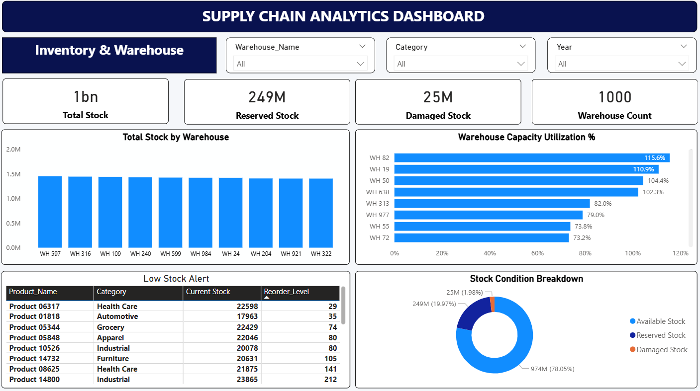
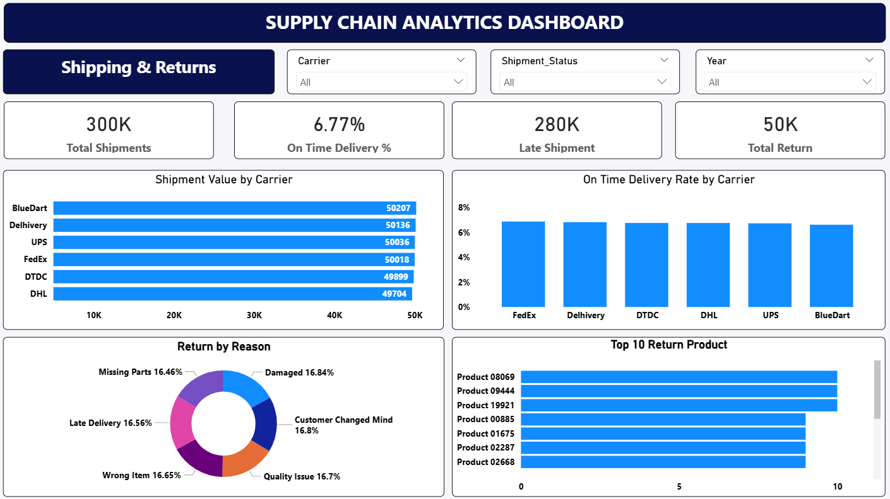
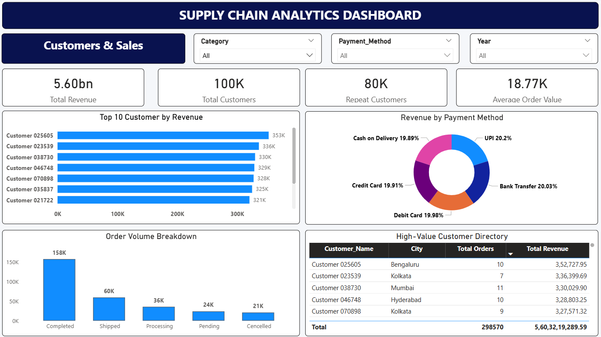

# 📦 End-to-End Enterprise Supply Chain Analytics Dashboard

An executive-grade Power BI dashboard suite engineered to monitor, diagnose, and optimize global supply chain operations across inventory health, logistics fulfillment, reverse logistics, and revenue performance.

---

## 📌 Project Overview

Managing modern supply chain networks requires real-time, end-to-end visibility across warehouse storage capacities, order fulfillment velocity, transit times, and return pipelines. This project models normalized relational transaction data into an enterprise-ready analytical data warehouse and an interactive 4-page Power BI dashboard suite.

* **Business Objectives:** 
  * Detect and alleviate warehouse over-utilization bottlenecks (>100% capacity).
  * Pinpoint logistics carrier delivery bottlenecks and late-shipment patterns.
  * Monitor customer lifetime value, payment adoption, and inventory buffer health.
* **Architecture:** Star schema modeling across **10 relational tables** powered by an automated central Calendar dimension.
* **Volume:** 300,000+ orders, 1,000 warehouses, 100K customers, and 5.61B in total revenue.

---

## 🖥️ Dashboard Architecture & Pages

The dashboard uses a standardized 1280 × 720 canvas resolution with consistent executive navigation and color palettes across four specialized views:

### 1. Executive Overview


C-suite operational cockpit providing high-level financial and fulfillment health.
* **Core KPIs:** Total Revenue (5.61B), Total Profit (1.13B), Total Orders (300K), Units Sold (6M), Average Order Value (18.71K).
* **Visual Breakdown:** 24-month Monthly Revenue Trend, Revenue Contribution by Product Category, Order Fulfillment Status Funnel, and Top 10 Products by Revenue.

---

### 2. Inventory & Warehouse


Facility capacity tracking, stock allocation integrity, and reorder alerts.
* **Core KPIs:** Total Stock (1B units), Reserved Stock (249M), Damaged Stock (25M), Active Warehouses (1,000).
* **Visual Breakdown:** Total Stock by Warehouse Hub, Warehouse Capacity Utilization % (highlighting facilities operating between 102% and 115% rated capacity), Stock Condition Breakdown (Available vs. Reserved vs. Damaged), and Low Stock Watchlist.

---

### 3. Shipping & Returns


Carrier performance SLAs and reverse logistics root-cause diagnostics.
* **Core KPIs:** Total Shipments (300K), On-Time Delivery Rate (6.77%), Late Shipments (280K), Total Returns (50K).
* **Visual Breakdown:** Shipment Volume by Carrier (BlueDart, Delhivery, UPS, FedEx, DTDC, DHL), On-Time Delivery Rate by Carrier, Return Reasons Breakdown, and Top Returned Products.

---

### 4. Customers & Sales


Retention metrics, customer lifetime spend, and omnichannel payment health.
* **Core KPIs:** Total Customers (100K), Repeat Customers (80K / 80% Retention Rate), Total Revenue, Average Order Value.
* **Visual Breakdown:** Top 10 Customers by Lifetime Value, Revenue Breakdown by Payment Method (UPI, COD, Net Banking, Credit/Debit Card), Order Status Distribution, and High-Value Customer Directory.

---

## ⚙️ Data Model & Schema Architecture

The analytical model implements a pure Star Schema built from **10 normalized tables** to guarantee maximum query performance and prevent cyclic join ambiguity:

```text
├── Fact Tables (Transactional Events)
│   ├── order_items_clean   (Item-level sales, Line_Total, Discount_Percent)
│   ├── order_clean         (Order headers: Dates, Status, Payment_Method, Warehouse_ID)
│   ├── shipment_clean      (Fulfillment: Delivery Dates, Carrier, Shipping_Cost)
│   ├── inventory_clean     (Snapshots: Stock_Quantity, Reserved_Quantity, Damaged_Quantity)
│   └── return_clean        (Reverse logistics: Return_Reason, Refund_Amount, Status)
│
├── Dimension Tables (Entities & Master Data)
│   ├── customer_clean      (Customer_ID, Geography: City, State, Country)
│   ├── product_clean       (Product_ID, Category, Unit_Cost, Selling_Price, Reorder_Level)
│   ├── warehouses_clean    (Warehouse_ID, Capacity_Units, Location)
│   ├── suppliers_clean     (Supplier_ID, Supplier_Name, Rating, Country)
│   └── employees_clean     (Employee_ID, Department, Job_Title, Warehouse_ID)
│
└── Supporting Architecture
    ├── DateTable           (Central DAX Calendar for Time Intelligence)
    └── Measure             (Dedicated DAX repository)
```
## 🧮 Selected DAX Measures
Code snippet
```dax
// 1. Warehouse Capacity Utilization %
Warehouse Utilization % = 
DIVIDE(
    [Total Stock],
    SUM('warehouses_clean'[Capacity_Units])
)

// 2. On-Time Delivery Rate %
On Time Delivery % = 
DIVIDE(
    [Total Shipments] - [Late Shipments],
    [Total Shipments]
)

// 3. Late Shipments Calculation
Late Shipments = 
CALCULATE(
    [Total Shipments],
    FILTER(
        'shipment_clean',
        'shipment_clean'[Actual_Delivery_Date] > 'shipment_clean'[Expected_Delivery_Date]
    )
)

// 4. Customer Repeat Rate
Repeat Customers = 
CALCULATE(
    DISTINCTCOUNT('order_clean'[Customer_ID]),
    FILTER(
        VALUES('order_clean'[Customer_ID]),
        CALCULATE(COUNT('order_clean'[Order_ID])) > 1
    )
)
```
### 🔍 Key Business Insights & Recommendations
* **Carrier SLA Restructuring:** On-time delivery stands at a critical low of 6.77% with 280K late shipments despite volume being evenly spread across major carriers (~50K shipments each). Logistics contracts need immediate renegotiation with strict on-time SLA penalties.

* **Warehouse Overcrowding:** Key hubs (WH 82, WH 19, WH 50, WH 638) exceed rated capacity by 102%–115%. A regional stock rebalancing program is necessary to route inbound units to underutilized facilities and reduce damaged stock incidents.

* **High Repeat Retention:** An 80% customer repeat rate demonstrates product-market fit and brand loyalty, meaning retention efforts should focus on tier-1 VIP accounts identified in the Customer Directory.

### 🛠️ Tech Stack
* **Business Intelligence:** Power BI Desktop

* **Calculations:** DAX (Data Analysis Expressions)  

* **ETL & Transformation:** Power Query (M)

* **Data Modeling:** Star Schema (Kimball Methodology)

* **Source Architecture:** Relational SQL (10 Clean Tables)

## 🚀 How to Run the Project Locally

### Prerequisites
* [Power BI Desktop](https://powerbi.microsoft.com/desktop/) (Free download from Microsoft)
* [Git](https://git-scm.com/downloads) & [Git LFS](https://git-lfs.com/) (Required to pull the large `.pbix` and `.csv` files)
* [MySQL Workbench](https://dev.mysql.com/downloads/workbench/) (or your preferred SQL client)

---

### Step-by-Step Setup

1. **Clone the repository and pull Git LFS objects:**
   ```bash
   git clone https://github.com/pwnydvv98-DataAnalytics/Supply-Chain-Analytics-PowerBI.git
   cd Supply-Chain-Analytics-PowerBI
   git lfs pull

 ### 2. Set up the Database & Datasets
* Open **MySQL Workbench**.
* Execute the scripts located inside the `sql/` directory to create the database schema and populate the tables.
* If connecting directly via flat files, verify the CSV datasets match the expected local paths.

### 3. Open and Refresh the Dashboard
* Open `supply_chain.pbix` in **Power BI Desktop**.
* Go to **Home** → **Transform Data** → **Data source settings**.
* Update the credentials and connection parameters to match your local MySQL server.
* Click **Close & Apply**, then hit **Refresh** to load the complete pipeline.
